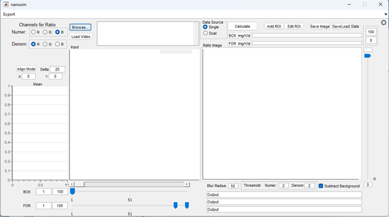
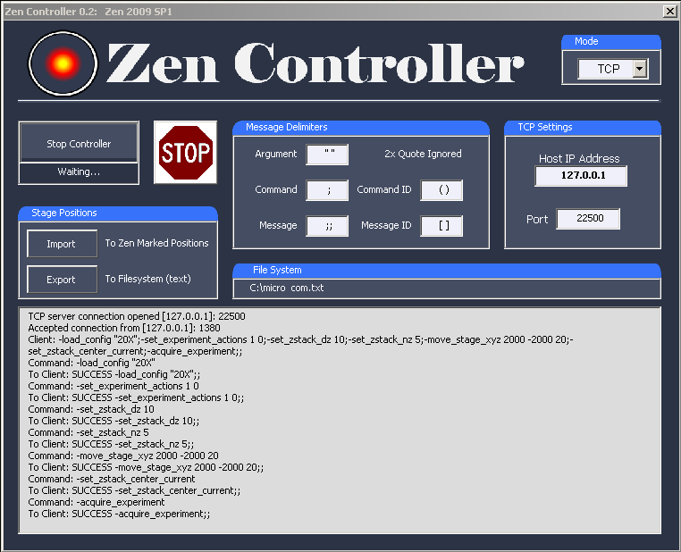

## Coding and Reasearch Portfolio

---

### Data Analysis Methods and Visualization

[Mirror Axis Distortion: A Novel Transform and Visualization for Fold Change Data](/pages/mirrored_axis_distortion.md)
 

---
[Contra-Analysis: A Holistic Method for Analyzing Effect Size from Controlled Experiments](/pages/contra-analysis.md)
 

---
[CIRCOAST: A Statistical Hypothesis Test for Cellular Colocalization with Network Structures](/pages/circle_colocalization_test.md)
 

---

### Quantification and Data Collection

[REAVER: A Simple semi-automated program to analyze blood vessel network architecture in 2D images](/pages/reaver.md)
 

---

[Nanoxim: User Interface to Monitor Surface Oxygenation of Open Wound in Real Time With Flourescent Nanoparticles](/pages/nanoxim.md)

---

[Zen Controller: Automation Software for Zeiss Confocal Miscropes Running Zen 2008](/pages/zen_controller.md)
 

---

### Teaching
[DS2003: COmmunicating with Data (2022-F, 2023-Sp, University of Virginia)](/pages/ds2003.md)
 

 
 
---

Page template forked from <a href="https://github.com/evanca/quick-portfolio">evanca</a>

<!-- Remove above link if you don't want to attibute -->
